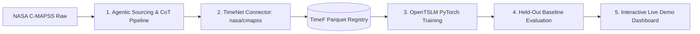

# AGENT.md — AeroGuard TSLM Project Instructions

This document governs the development of **AeroGuard TSLM**, a Temporal AI predictive maintenance system built for the European Hackathon League (*"Give AI a Sense of Time"*, hosted by Aionic Labs and ETH Agentic Systems Lab).

---

## 1. Project Overview & Objective

* **Core Goal**: Transform multi-sensor turbofan engine telemetry into an intelligent diagnostic system that estimates Remaining Useful Life (RUL), diagnoses component degradation, and prescribes maintenance actions in natural language.
* **Infrastructure**: Aionic's **TimeNet** SDK/CLI for standardized temporal data representation (`TimeF`), combined with **OpenTSLM** (Time-Series Language Models) for multimodal reasoning.
* **Target Dataset**: NASA C-MAPSS Turbofan Engine Degradation (`nasa/cmapss`).
* **Target User**: Aerospace reliability engineer and fleet maintenance manager.

---

## 2. System Architecture & Workstreams



### Workstream 1: Agentic Data Sourcing & CoT Synthesis
* **Script**: `scripts/agentic_cmapss_pipeline.py`
* **Responsibilities**:
  1. Fetch and parse raw C-MAPSS telemetry across operational cycles.
  2. Segment cycles into sliding observation windows ($T=30$ to $50$ cycles).
  3. Formulate leakage-free train/test splits partitioned strictly by `unit_number` (engine ID).
  4. Generate rich aerospace engineering Chain-of-Thought (`rationale`) paired with ground-truth RUL (`target`).

### Workstream 2: TimeNet Connector (`packages/timenet-connectors`)
* **Package Path**: `packages/timenet-connectors/src/timenet_connectors/datasets/nasa/cmapss/`
* **Artifacts**:
  - `dataset.yaml`: Manifest card with license, tags (`turbofan`, `predictive-maintenance`, `rul`), and domain `engineering`.
  - `connector.py`: `CMAPSSConnector` subclassing `BaseHuggingFaceConnector`.
  - `__init__.py`: Exports `CONNECTOR = CMAPSSConnector`.
  - `tests/test_connector.py`: Fixture-based test verifying conversion without network access.
* **Signal Contract**:
  - 21 multivariate telemetry channels on `OrdinalAxis(length=T)`.
  - Proper Pint units via `ureg`: `ureg.degree_Rankine`, `ureg.psi`, `ureg.revolutions_per_minute`, `ureg.cycle`.
* **Tasks**:
  - `AnswerTask`: Prompt + Rationale + Evaluation Target.
  - `ScalarPredictionTask`: Numeric RUL prediction in `ureg.cycle`.

### Workstream 3: OpenTSLM Model Integration & Fine-Tuning
* **Script**: `training/train_opentslm.py`
* **Loading via TimeNet**:
  ```python
  from timenet.client import TimeNet

  tn = TimeNet(registry="local_registry")
  torch_dataset = tn.load_torch("nasa/cmapss")
  ```
* **Backbone**: `meta-llama/Llama-3.2-1B-Instruct` or `google/gemma-3-1b-pt`.
* **Architecture**: OpenTSLM patch encoder for temporal signals + LoRA on attention projection layers.

### Workstream 4: Held-Out Baseline Benchmarking
* **Script**: `training/evaluate_baselines.py`
* **Evaluation Invariant**: Must evaluate on unseen engine units (zero leakage).
* **Models to Compare**:
  1. **AeroGuard TSLM**: Native sensor token embeddings + text prompt.
  2. **Text-Only LLM**: Standard LLM prompted with tabular numerical averages (demonstrates hallucination & temporal blindness).
  3. **Classical ML (XGBoost/RF)**: Tabular regressor (demonstrates good numeric fit but zero explainability or actionability).
* **Metrics**: RMSE, NASA Score Function, BLEU/ROUGE for CoT diagnostic accuracy.

### Workstream 5: Interactive Live Demo Dashboard
* **App Path**: `demo/app.py`
* **Stack**: Streamlit + Plotly (modern dark theme).
* **Features**:
  - Dropdown selector for held-out engine units.
  - Interactive multi-channel sensor waveform viewer with anomaly threshold indicators.
  - One-click "Analyze with AeroGuard TSLM" with streaming Chain-of-Thought output.
  - RUL forecast card + automated Maintenance Action Dispatch.
  - Side-by-side comparison tab contrasting TSLM against the text-only baseline.

---

## 3. Operating Rules & Constraints for Coding Agents

1. **Environment & Tooling**:
   - Use `uv` exclusively. Do not call `pip install` directly.
   - Run `make check` (ruff formatting, linting, type-checking) after every change.
   - Keep `uv.lock` synchronized.
2. **TimeNet API & Conventions**:
   - Use TimeNet exceptions from `timenet.errors`: `TimeFValidationError` for invalid inputs, `TimeFFormatError` for corrupt disk artifacts.
   - Never materialize all time-series in memory at once; use lazy loaders (`TimeSeries.from_loader` or `TimeFDataset` streaming).
   - Do not use raw strings for tasks; import and use typed task classes from `timenet.types`.
3. **Data Leakage Prohibition**:
   - Never split records randomly by time-step within an engine.
   - Engine IDs in the training set must NEVER appear in validation or testing.
4. **Code Quality**:
   - Google-style docstrings on all public functions, classes, and modules.
   - Strict type hints (`py.typed` compliance; `ty check` must pass cleanly).

---

## 4. Quick Verification Runbook

```bash
# 1. Environment sync
make sync

# 2. Run connector fixture tests
uv run pytest packages/timenet-connectors/src/timenet_connectors/datasets/nasa/cmapss/tests/

# 3. Build dataset to a local registry
uv run timenet-build build nasa/cmapss --out local_registry

# 4. Verify dataset loads and describes cleanly
uv run python -c "from timenet.client import TimeNet; print(TimeNet(registry='local_registry').load('nasa/cmapss').describe())"

# 5. Format, lint, and typecheck
make check

# 6. Launch the demo application
uv run streamlit run demo/app.py
```

---

## 5. Hackathon Jury Alignment Checklist

- [ ] **Aionic Labs Criteria**: Clean `nasa/cmapss` connector adhering to the TimeF specification, valid manifest, and properly registered in local storage.
- [ ] **ETH Agentic Systems Lab Criteria**: Autonomous agentic pipeline that discovers/synthesizes engineering CoT reasoning; multimodal temporal reasoning tested against text-only baselines.
- [ ] **Demo Impact**: Real-time streaming CoT, interactive Plotly telemetry, and clear operational decisions for an aviation reliability engineer.
