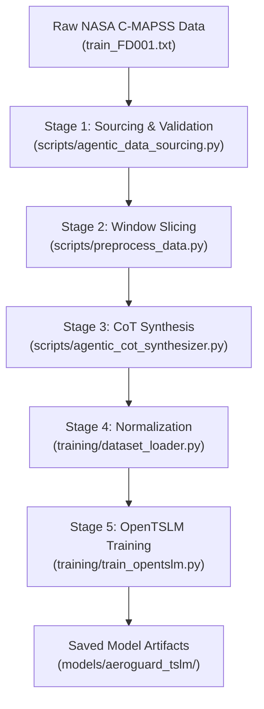

# ✈️ AeroGuard TSLM: A Beginner-Friendly Technical Tutorial

> **Multimodal Time-Series Language Model for Turbofan Predictive Maintenance & Aerothermal Prognostics**  
> **Team TimeLapse** — *EHL Hackathon Zurich 2026 (Aionic Labs × ETH Agentic Systems Lab)*

Welcome to **AeroGuard TSLM**! If you are new to predictive maintenance, time-series forecasting, or multimodal language models, this tutorial is designed for you. It explains what this repository does, why it matters, how every component works under the hood, and how you can run and experiment with it yourself.

---

## 📑 Table of Contents
1. [The Big Picture: What Problem Does AeroGuard Solve?](#1-the-big-picture-what-problem-does-aeroguard-solve)
2. [Core Concepts Explained for Beginners](#2-core-concepts-explained-for-beginners)
3. [Repository Map: Where Everything Lives](#3-repository-map-where-everything-lives)
4. [The 5-Stage Data & Training Pipeline](#4-the-5-stage-data--training-pipeline)
5. [Under the Hood: The Neural Network Architecture](#5-under-the-hood-the-neural-network-architecture)
6. [Hands-On Guide: How to Run the Code](#6-hands-on-guide-how-to-run-the-code)
7. [Understanding the Evaluation & Benchmarks](#7-understanding-the-evaluation--benchmarks)
8. [Component Fault Isolation & Flight Dispatch](#8-component-fault-isolation--flight-dispatch)
9. [Beginner Glossary & Troubleshooting FAQ](#9-beginner-glossary--troubleshooting-faq)

---

## 1. The Big Picture: What Problem Does AeroGuard Solve?

### The $150,000 Outstation Grounding Problem
Imagine a commercial jet landing in an airport thousands of miles away from its main maintenance hub. Suddenly, an engine sensor warning lights up. The airline has to ground the plane (**Aircraft on Ground**, or **AOG**). 

Every hour that plane sits idle costs an airline thousands of dollars in canceled flights, passenger hotels, and emergency parts shipments. A single unscheduled grounding can easily cost **over $150,000**.

```text
Traditional Maintenance Dilemma:
  📅 Fixed Calendar Overhaul ──────► Retires healthy engines too early (wastes millions)
  ⚠️ Unpredicted In-Flight Wear ──► Engine breaks down unexpectedly at outstations ($150k+ AOG)
  🤖 Pure Numerical AI (Chronos) ─► Gives a number (e.g. "RUL = 25"), but CANNOT explain WHY
  💬 Standard Text-Only LLM ──────► Suffers from "tabular blindness", hallucinates fake parts
```

### Why Existing Solutions Fall Short
Airlines have tried three main approaches:
1. **Fixed Schedules (Calendar Limits)**: Overhaul the engine every 3,000 flights regardless of condition.  
   *Problem*: You throw away millions of dollars replacing perfectly healthy components, or you miss accelerated wear caused by extreme heat and dusty air.
2. **Pure Time-Series AI (e.g., Amazon Chronos)**: Statistical or Transformer models that look at numbers and output numbers.  
   *Problem*: They treat each sensor channel independently in discrete token bins. Jet engine failure is fundamentally *multivariate* (sensors drift together in coupled physical ways). Furthermore, a single number gives aircraft mechanics zero explanation of *what* is broken.
3. **Standard Text-Only LLMs (ChatGPT / Claude prompted with raw numbers)**: Pasting tables of raw sensor numbers into a prompt.  
   *Problem*: LLMs suffer from "tabular blindness"—they cannot reliably discern minute mathematical slopes across 400 numbers in text format and often hallucinate non-existent part numbers.

### The AeroGuard TSLM Solution
**AeroGuard TSLM** (Time-Series Language Model) bridges continuous engine telemetry directly into the brain of a lightweight Large Language Model ([`SmolLM-135M-Instruct`](https://huggingface.co/HuggingFaceTB/SmolLM-135M-Instruct)).

In a **single forward pass**, it does two things at once:
1. **Predicts Remaining Useful Life (RUL)**: Accurately predicts how many flight cycles the engine has left before failure.
2. **Generates Chain-of-Thought (CoT) Diagnostics**: Writes an expert aerothermal analysis in plain English, explaining which station is degrading, why temperatures are rising, and what exact maintenance tasks the crew should take.

---

## 2. Core Concepts Explained for Beginners

Before jumping into the code, let's establish the key mental models.

### A. What is a Turbofan Engine and its "Stations"?
A modern commercial jet engine (like a CFM56) is a high-bypass turbofan. Air enters the front, is compressed, mixed with jet fuel, combusted, expanded through turbines, and expelled out the back:

```text
       ┌─────────┐                                ┌─────────┐
       │ Fan/LPC │ ◄─── Low-Pressure Spool ─────► │   LPT   │
       └────┬────┘                                └────┬────┘
            │                                          │
 ┌──────┐ ┌─┴─┐      ┌─────┐        ┌─────┐   ┌───┐  ┌─┴─┐  ┌───────┐
 │ Air  ├►│Fan├─────►│ LPC ├───────►│ HPC ├──►│CC ├─►│HPT├──┤Exhaust│
 │Inlet │ └─┬─┘      └─────┘        └──┬──┘   └───┘  └───┘  └───────┘
 └──────┘   │                          │
  Station 2 │        Station 24        │ Station 30          Station 50
            ▼                          ▼                     ▼
       Bypass Duct             High-Pressure           Exhaust Gas Temp
       (Station 15)            Compressor              (EGT Surge!)
                               (PRIMARY WEAR)
```

In aerospace engineering, engines are divided into numbered **Stations**:
* **Station 2**: Air Inlet & Fan.
* **Station 24**: Low-Pressure Compressor (LPC) exit.
* **Station 30**: High-Pressure Compressor (HPC) exit. In our dataset, **this is the primary component that wears down** (blade tip clearance widens and efficiency drops).
* **Station 41/42**: High-Pressure Turbine (HPT) and Low-Pressure Turbine (LPT).
* **Station 50**: Exhaust Gas Temperature ($T_{50}$ / EGT). When the compressor degrades, the engine burns hotter to maintain thrust, causing $T_{50}$ to surge!

### B. The NASA C-MAPSS Dataset (`FD001`)
The dataset comes from NASA's **Commercial Modular Aero-Propulsion System Simulation (C-MAPSS)**:
* **100 simulated engines** run from brand-new condition all the way to complete structural failure.
* **20,631 total flight cycles** of telemetry.
* Each flight records **21 sensor channels** (temperatures, pressures, rotor speeds, fuel ratios).

### C. Why 14 Sensors Instead of 21?
Raw C-MAPSS contains 21 sensors, but **7 of those sensors never change**:
* At steady-state sea-level cruise, ambient parameters like total inlet temperature ($T_2$) or ambient pressure ($P_2$) have **zero variance** ($\sigma = 0$).
* If you feed zero-variance columns into statistical models, normalizers, or covariance matrices, you trigger division-by-zero or singular matrix errors.
* AeroGuard systematically keeps only the **14 active aerothermal channels** (such as $T_{50}$ exhaust temperature, $Ps_{30}$ static pressure, $N_c$ core speed, and $BPR$ bypass ratio).

### D. What is a "30-Cycle Observation Window"?
Airlines don't make maintenance decisions based on a single sensor blip. Instead, AeroGuard looks at a **sliding window of 30 consecutive flight cycles** with a stride of 5 cycles:
* Window 1: Cycles 1 to 30
* Window 2: Cycles 6 to 35
* Window 3: Cycles 11 to 40 ... and so on.
* Crucially, the **terminal window** (the very last 30 cycles before engine failure) is always captured so the model learns the near-failure signature.

### E. What is RUL (Remaining Useful Life)?
If Engine #1 survives for 192 total cycles, and our window ends at cycle 140:
$$\text{RUL} = 192 - 140 = 52 \text{ cycles}$$
* **$\text{RUL} \le 30$**: `CRITICAL` (Imminent failure risk; urgent ground inspection required).
* **$31 \le \text{RUL} \le 75$**: `WARNING` (Moderate wear; plan borescope inspection soon).
* **$\text{RUL} > 75$**: `NORMAL` (Healthy operational envelope; continue regular monitoring).

### F. Strict Zero Data Leakage Rule
In machine learning, **data leakage** happens when information from the test set sneaks into the training process, causing overly optimistic results.
AeroGuard enforces strict zero leakage:
1. **Split by Engine ID**:
   * **Training**: Engines 1 to 70 (2,502 windows)
   * **Validation**: Engines 71 to 80 (355 windows)
   * **Test**: Engines 81 to 100 (806 windows — completely unseen held-out engines!)
2. **Normalization Separation**: The mean and standard deviation used to normalize telemetry are calculated **strictly on Engines 1–70**.
3. **No Ground Truth in Test Prompts**: During testing, ground-truth RUL is withheld; the model must infer everything purely from sensor waveforms.

---

## 3. Repository Map: Where Everything Lives

Here is the directory structure of the repository and what each folder does:

```text
timelapse/
├── run_pipeline.sh                      # 🚀 One-click master shell script
├── Makefile                             # Build, lint, and test commands
├── pyproject.toml                       # Dependencies and package metadata
├── tutorial.md                          # 📖 This beginner guide!
├── README.md                            # High-level overview and benchmark results
├── REPO_DETAILS.md                      # Exhaustive technical physics dossier
│
├── data/
│   ├── raw/train_FD001.txt              # Raw NASA C-MAPSS telemetry file
│   └── processed/
│       ├── windows.jsonl                # 3,663 sliced 30-cycle telemetry windows
│       └── dataset_manifest.json        # Integrity hashes and split metadata
│
├── scripts/                             # 🛠️ Data preparation & pipeline scripts
│   ├── run_pipeline.py                  # Master 5-stage orchestrator
│   ├── agentic_data_sourcing.py         # Stage 1: Raw data validation & hashing
│   ├── preprocess_data.py               # Stage 2: Slicing 30-cycle windows
│   ├── agentic_cot_synthesizer.py       # Stage 3: Aerospace Chain-of-Thought generator
│   ├── build_timef_registry.py          # Optional: Aionic TimeNet TimeF exporter
│   ├── run_demonstration.py             # CLI demonstration on held-out Engine #84
│   └── generate_benchmark_summary.py   # Benchmark summary exporter
│
├── training/                            # 🧠 PyTorch Neural Network & Inference
│   ├── train_opentslm.py                # OpenTSLM model architecture & training loop
│   ├── dataset_loader.py                # Lazy JSONL reader, normalizer & token masker
│   ├── inference.py                     # AeroGuardPredictor for loading & running models
│   ├── fault_isolation.py               # Physical Station 30 fault detection rules
│   ├── train_baselines.py               # Amazon Chronos & Ridge baseline training
│   ├── baseline_inference.py            # Baseline inference engine
│   └── evaluate_baselines.py            # Evaluator on held-out test engines 81-100
│
├── packages/
│   └── aeroguard-connectors/            # Reusable TimeNet dataset connector
│
├── demo/                                # 🖥️ Interactive Web Dashboard
│   ├── app.py                           # Streamlit Mission Control application
│   └── assets/                          # Diagrams and visual graphics
│
├── models/
│   ├── aeroguard_tslm/                  # Trained model weights & LoRA adapters
│   └── baselines/                       # Frozen baseline artifacts
│
└── artifacts/                           # 📊 Reports, dossiers, and benchmarks
    ├── dataset_sourcing_dossier.json    # Verification record of raw data
    ├── benchmark_results.json           # Evaluation metrics on Engines 81-100
    └── slide_plots/                     # Generated presentation charts
```

---

## 4. The 5-Stage Data & Training Pipeline

The whole system is designed as an automated, reproducible 5-stage pipeline:



Let's examine what happens at each stage:

### Stage 1: Data Sourcing & Schema Validation
* **File**: [`scripts/agentic_data_sourcing.py`](file:///home/ubuntu/Project/timelapse/scripts/agentic_data_sourcing.py)
* **What it does**: Checks if `data/raw/train_FD001.txt` exists. Verifies its SHA-256 cryptographic hash (`963b5e22...`), verifies that all 20,631 rows and 100 engine units are present, and confirms zero missing values.
* **Output**: Generates [`artifacts/dataset_sourcing_dossier.json`](file:///home/ubuntu/Project/timelapse/artifacts/dataset_sourcing_dossier.json).

### Stage 2: Window Slicing & Engine Splitting
* **File**: [`scripts/preprocess_data.py`](file:///home/ubuntu/Project/timelapse/scripts/preprocess_data.py)
* **What it does**:
  1. Filters out the 7 constant sensors, retaining the 14 active aerothermal channels.
  2. Slices the continuous telemetry into rolling windows of **30 flight cycles** (stride = 5 cycles).
  3. Partitions the engines into Train (1–70), Val (71–80), and Test (81–100).
* **Output**: Generates `data/processed/windows.jsonl` (3,663 total records) and `dataset_manifest.json`.

### Stage 3: Chain-of-Thought (CoT) Diagnostic Synthesis
* **File**: [`scripts/agentic_cot_synthesizer.py`](file:///home/ubuntu/Project/timelapse/scripts/agentic_cot_synthesizer.py)
* **What it does**: Enriches each window with structured aerospace engineering reasoning following a 4-part schema:
  1. **Telemetry Observations**: What did each key sensor do? (e.g., $T_{50}$ shifted by $+4.2^\circ\text{R}$, $Ps_{30}$ dropped by $-0.22\text{ psia}$).
  2. **Thermodynamic Analysis**: Why did this happen physically? (Widening HPC blade clearances causes aerodynamic boundary layer separation, forcing fuel compensation).
  3. **Health Assessment**: What is the severity band? (`NORMAL`, `WARNING`, or `CRITICAL`).
  4. **Maintenance Directive**: What must maintenance do? (e.g., Schedule on-wing borescope inspection of compressor rotor blades within 25 cycles).

### Stage 4: Normalization Pre-Computation
* **File**: [`training/dataset_loader.py`](file:///home/ubuntu/Project/timelapse/training/dataset_loader.py)
* **What it does**:
  * Calculates the mean ($\mu$) and standard deviation ($\sigma$) for each of the 14 sensor channels.
  * **Strict Invariant**: These statistics are calculated **only from training engines (Units 1–70)**.
* **Output**: Writes [`models/aeroguard_tslm/preprocessing.json`](file:///home/ubuntu/Project/timelapse/models/aeroguard_tslm/preprocessing.json).

### Stage 5: OpenTSLM Model Fine-Tuning
* **File**: [`training/train_opentslm.py`](file:///home/ubuntu/Project/timelapse/training/train_opentslm.py)
* **What it does**:
  * Initializes the `TimeSeriesPatchEncoder` and attaches LoRA adapters to `SmolLM-135M-Instruct`.
  * Optimizes the multi-task loss (Language Modeling Cross-Entropy + Auxiliary RUL MSE).
  * Saves trained adapter weights and tokenizer to `models/aeroguard_tslm/`.

---

## 5. Under the Hood: The Neural Network Architecture

How do you get a text-based Large Language Model to "see" continuous physical sensor graphs?  
The secret is **Prefix Token Fusion**.

```text
14 Sensor Channels                 ┌─────────────────────────────┐
(Window Length = 30)               │  TimeSeriesPatchEncoder     │
Shape: [Batch, 14, 30] ───────────►│  Unfold(10) + Linear(140)   │───► [Batch, 3, 2048] (3 Patch Tokens)
                                   │  + LayerNorm                │
                                   └─────────────────────────────┘              │
                                                                                ▼ Concatenate
Prompt Text Query                  ┌─────────────────────────────┐          ┌──────────────┐
"Estimate RUL and diagnose..." ───►│  Tokenizer + Embedding      │─────────►│ Prefix Token │──► LoRA SmolLM-135M
Shape: [Batch, Length]             │  Layer (Hidden Dim = 2048)  │          │ Fusion       │    (r=16, alpha=32)
                                   └─────────────────────────────┘          └──────────────┘
                                                                                │        │
                                                ┌───────────────────────────────┘        └───────────────────────────────┐
                                                ▼                                                                        ▼
                                   Auxiliary RUL Head (MLP)                                                 Autoregressive Causal LM
                                   Mean-pool -> Linear(2048, 128) -> GELU -> Linear(1)                      Predicts diagnostic CoT tokens:
                                   Output: Scalar RUL (e.g. 24.3 cycles)                                    "Status: CRITICAL. Over the past..."
```

### Step-by-Step Tensor Transformation

Let's trace the exact shapes through the forward pass:

#### Step 1: Patching the Time-Series
* We have **14 sensors** observed over **30 cycles**. In PyTorch, the input tensor $x$ has shape:
  $$[B, 14, 30]$$
  *(where $B$ is the batch size, e.g. 16).*
* We slice time into patches of length 10 using `torch.unfold(dimension=-1, size=10, step=10)`:
  $$30 \text{ cycles} \div 10 = \mathbf{3 \text{ temporal patches}}$$
* Each patch contains $14 \times 10 = 140$ numbers. We flatten and permute:
  $$\text{Patches Shape}: [B, 3, 140]$$

#### Step 2: Projecting into LLM Embedding Space
* The base language model (`SmolLM-135M`) has an internal embedding dimension of $D = 2048$.
* A simple linear projection layer (`nn.Linear(140, 2048)`) followed by `nn.LayerNorm(2048)` transforms the 140 raw sensor numbers into a 2048-dimensional vector:
  $$\text{Patch Tokens}: [B, 3, 2048]$$
* **Intuition**: Each patch token acts just like a "word token" to the LLM, but instead of representing a word like `"engine"`, it represents a 10-cycle physical snapshot of all 14 sensors!

#### Step 3: Prefix Token Fusion
* The prompt text (e.g., `"Using these 14 sensor channels over the past 30 cycles..."`) is tokenized into $L$ text tokens and mapped to embeddings of shape $[B, L, 2048]$.
* We concatenate the 3 patch tokens and the text tokens along the sequence dimension:
  $$\text{Fused Embeddings}: [B, 3 + L, 2048]$$
* Now the language model can attend to both the sensor waveform patches and the text prompt in its self-attention layers!

#### Step 4: Selective Label Masking (`-100`)
* We do **not** want the language model to calculate cross-entropy loss on the sensor patch tokens or the prompt tokens.
* In PyTorch's `nn.CrossEntropyLoss`, label tokens set to `-100` are ignored.
* AeroGuard sets all temporal patch tokens and prompt tokens to `-100`, so loss is **only computed on the generated diagnostic reasoning**.

#### Step 5: Dual Output Heads & Multi-Task Loss
AeroGuard produces two outputs simultaneously:
1. **The Diagnostic Text**: Generated autoregressively by the causal language model head.
2. **The Numerical RUL**: Generated by mean-pooling the 3 temporal patch embeddings and passing them through a lightweight 2-layer MLP head:
   $$\text{Mean Pool}([B, 3, 2048]) \to [B, 2048] \xrightarrow{\text{Linear}} [B, 128] \xrightarrow{\text{GELU}} \xrightarrow{\text{Linear}} [B, 1]$$

The total training loss balances both tasks:
$$\mathcal{L}_{\text{total}} = \mathcal{L}_{\text{LM}} + 0.01 \cdot \mathcal{L}_{\text{RUL}}$$

> [!NOTE]
> **Why the 0.01 multiplier?**  
> Language modeling cross-entropy loss typically ranges between $1.0$ and $3.0$, whereas Mean Squared Error (MSE) on RUL (e.g. $(50 - 30)^2 = 400$) can be in the hundreds! The $0.01$ weighting prevents the RUL regression loss from overpowering the language modeling gradients.

#### Step 6: Parameter-Efficient Fine-Tuning with LoRA
Instead of updating all 135 million weights in SmolLM, we use **LoRA (Low-Rank Adaptation)**:
* We freeze the entire base LLM.
* We insert small low-rank adapter matrices ($r=16, \alpha=32$) into the attention query, key, value, and output projection layers (`q_proj`, `k_proj`, `v_proj`, `o_proj`).
* **Benefit**: We train less than 2% of the parameters, saving GPU memory and enabling super-fast training even on consumer hardware or CPU.

---

## 6. Hands-On Guide: How to Run the Code

This repository uses [`uv`](https://github.com/astral-sh/uv), a fast Python package and project manager.

### Prerequisites & Installation

1. Make sure you have Python 3.11+ installed.
2. Sync the dependencies using `uv` and the project `Makefile`:
   ```bash
   # Synchronize virtual environment with pinned locked dependencies
   make sync
   ```

---

### Step 1: Run the 30-Second Smoke Test
If you want to verify that the entire pipeline runs without waiting for a full training session, run the smoke test. It runs all stages and caps training at 5 optimizer steps:

```bash
make smoke-pipeline
```
*Expected output*: Stages 1 through 5 will execute, verify data integrity, slice windows, synthesize CoT, run 5 training steps, and cleanly export test adapters to `models/test_smoke_pipeline/`.

---

### Step 2: Run the Full End-to-End Pipeline
To run the complete production pipeline (data sourcing, window slicing, CoT synthesis, normalization, and full 3-epoch training):

```bash
# Option A: One-click shell script
./run_pipeline.sh

# Option B: Via Makefile
make pipeline

# Option C: Configurable CLI
uv run python -m scripts.run_pipeline --epochs 3 --batch-size 16 --lr 2e-4
```

---

### Step 3: Launch the Interactive Mission Control Dashboard
AeroGuard comes with an interactive **Streamlit web dashboard** featuring live Plotly telemetry graphs, an interactive Digital Twin cross-section, streaming Chain-of-Thought diagnostics, and ETOPS flight clearance:

```bash
uv run streamlit run demo/app.py
```
Open your browser to `http://localhost:8501`.

```text
What you can do in the Dashboard:
• Select any engine (e.g. held-out test Engine #84) and scrub across its operational lifetime.
• Inspect real-time sensor waveforms (T50 exhaust surge, Ps30 compressor drop).
• Click "Generate AeroGuard Diagnostic" to watch the model stream its Chain-of-Thought live.
• Compare side-by-side against baseline models (Amazon Chronos and Text-Only LLM).
• Check ETOPS flight route dispatch clearance (whether the engine is safe to fly over oceans).
```

---

### Step 4: Run a Standalone Terminal Demonstration
If you want to see the model run directly in your terminal on held-out Engine #84 (comparing a mid-life nominal cycle against a near-failure terminal cycle):

```bash
uv run python -m scripts.run_demonstration
```

---

### Step 5: Run Baseline Benchmarks
To evaluate all models on the held-out test set (Engines 81–100) and update [`artifacts/benchmark_results.json`](file:///home/ubuntu/Project/timelapse/artifacts/benchmark_results.json):

```bash
# 1. Prepare baselines once (trains Ridge head on Chronos embeddings)
uv run python -m training.train_baselines

# 2. Evaluate all models on held-out test windows
uv run python -m training.evaluate_baselines --model-dir models/aeroguard_tslm
```

---

### Step 6: Code Quality & Hygiene
To run the test suite, formatter, and linter:

```bash
# Run pytest unit tests
uv run python -m pytest -q

# Run full suite: lock check, formatting, linting, type checks, and tests
make check
```

---

## 7. Understanding the Evaluation & Benchmarks

When evaluating predictive maintenance models, accuracy is crucial, but **direction of error** is even more important!

### The Held-Out Test Split (Engines 81–100)
AeroGuard was benchmarked on **806 held-out observation windows** from engines 81–100. These engines were never seen during training or normalization fitting:

| Model Architecture | Input Modality | RUL RMSE ↓ | RUL MAE ↓ | NASA Score ↓ | Explainability & Root Cause | Component Localization |
| :--- | :--- | :---: | :---: | :---: | :--- | :--- |
| **AeroGuard TSLM (Ours)** | 14 Continuous Sensor Patches + Prompt | **7.94** | **6.31** | **686.2** | **High** (Causal aerothermal CoT) | **Yes** (Station 30 HPC Rotor Blades & Stator Vanes) |
| **Baseline: Text-Only LLM** | Serialized ASCII Number Tables | 21.11 | 16.81 | 15,197.2 | **Unreliable** (Tabular blindness) | **No** (Fabricated / hallucinated parts) |
| **Amazon Chronos (T5)** | 14 Discretized Time-Series Tokens | 53.93 | 40.12 | 17,218,386.0 | **None** (Pure numerical foundation model) | **No** (Univariate tokens only) |
| **Static Schedule (Legacy)** | Flight Cycle Counter Only | 58.14 | 46.20 | 8,912,400.0 | **None** (Blind calendar threshold) | **No** (Ignores all telemetry) |

### Why AeroGuard Crushes Amazon Chronos (85% Error Reduction)
Amazon Chronos is a general-purpose time-series model that discretizes numbers into token buckets. However, jet engine thermodynamics relies on **multivariate coupling**:
* When compressor blades wear down, static pressure ($Ps_{30}$) drops **at the exact same time** that exhaust temperature ($T_{50}$) surges.
* Chronos tokenizes each channel separately, missing this physical coupling.
* AeroGuard folds all 14 channels into unified temporal patch tokens, preserving the cross-sensor physical correlation.

### The Asymmetric NASA Scoring Function
Standard metrics like RMSE (Root Mean Squared Error) treat early predictions and late predictions identically. In aviation, they are **vastly different**:
* **Early Prediction ($\hat{y} < y$)**: You predict the engine has 20 cycles left when it actually has 30. You pull it into the shop slightly early. This costs a little bit of money in maintenance scheduling.
* **Late Prediction ($\hat{y} > y$)**: You predict the engine has 30 cycles left when it actually has 10! The engine fails in mid-air. This is catastrophic.

NASA developed an **asymmetric exponential penalty score**:
$$s = \sum_{i=1}^N h(d_i), \quad \text{where } d_i = \hat{y}_i - y_i$$
$$h(d) = \begin{cases} e^{-d/13} - 1 & \text{if } d < 0 \quad (\text{Early prediction penalty}) \\ e^{d/10} - 1 & \text{if } d \ge 0 \quad (\text{Late prediction penalty — heavily penalized!}) \end{cases}$$

Notice the denominator: $10$ for positive errors (late) versus $13$ for negative errors (early). Late predictions are penalized exponentially harder! AeroGuard achieves a NASA score of **686.2**, compared to millions for naive statistical baselines.

---

## 8. Component Fault Isolation & Flight Dispatch

AeroGuard doesn't just predict a number; it grounds its predictions in aircraft operations.

### Physical Rule-Based Fault Isolation
In [`training/fault_isolation.py`](file:///home/ubuntu/Project/timelapse/training/fault_isolation.py), observed sensor changes are mapped to aerothermal fault modes:
* **Evidence Check**: Did $T_{50}$ increase by $> +2.0^\circ\text{R}$ while $Ps_{30}$ dropped by $< -0.15\text{ psia}$?
* **Fault Station**: Station 30 (High-Pressure Compressor).
* **Degradation Mechanism**: Compressor blade tip clearance erosion and aerodynamic boundary layer separation.
* **Line-Replaceable Unit (LRU)**: HPC Rotor Blade Stage 5–8 Assembly (`CFM56-HPC-RB25`) under Aircraft Maintenance Manual task card `AMM 72-31-00`.

### Automated ETOPS Flight Dispatch Guidance
**ETOPS** (*Extended-range Twin-engine Operational Performance Standards*) dictates how far a twin-engine jet is allowed to fly from the nearest diversion airport:
* **$\text{RUL} > 75$ cycles (`NORMAL`)**: Approved for **ETOPS-180** (Transoceanic flights up to 180 minutes away from an emergency runway).
* **$30 < \text{RUL} \le 75$ cycles (`WARNING`)**: **ETOPS Restricted** (Limited to overland overland domestic sectors; on-wing borescope inspection required).
* **$\text{RUL} \le 30$ cycles (`CRITICAL`)**: **AOG Grounding Alert** (Revoke dispatch clearance; immediate single-flight ferry permit to maintenance overhaul base only).

---

## 9. Beginner Glossary & Troubleshooting FAQ

### Glossary of Aerospace & ML Acronyms
* **AOG (Aircraft on Ground)**: An emergency condition where an aircraft is grounded due to a mechanical issue, incurring high delay costs.
* **C-MAPSS**: Commercial Modular Aero-Propulsion System Simulation, a high-fidelity jet engine simulator developed by NASA.
* **CoT (Chain-of-Thought)**: A prompt/generation technique where an AI breaks down its reasoning step-by-step before stating a conclusion.
* **EGT (Exhaust Gas Temperature)**: Temperature of the gas exiting the turbine (measured at Station 50, sensor 4).
* **ETOPS**: Extended-range Twin-engine Operational Performance Standards (safety rules for twin-engine transoceanic flights).
* **HPC**: High-Pressure Compressor (the engine component between Station 24 and Station 30).
* **LoRA**: Low-Rank Adaptation (a parameter-efficient fine-tuning technique for LLMs).
* **LRU**: Line-Replaceable Unit (a modular aircraft component that can be quickly swapped on the airport ramp).
* **Prefix Token Fusion**: Injecting non-text embeddings (like sensor patches) into an LLM's sequence before text tokens.
* **RUL (Remaining Useful Life)**: The number of operational flight cycles left before an engine component fails.
* **TSLM**: Time-Series Language Model.

---

### Troubleshooting FAQ

#### Q: I get `Triton Error: Python.h not found` when running PyTorch.
* **Why**: Triton requires Python C-header files to compile custom GPU kernels on Linux.
* **Fix**: Install the Python development headers:
  ```bash
  sudo apt-get update && sudo apt-get install -y python3-dev python3.12-dev
  ```

#### Q: I get CUDA Out of Memory (OOM).
* **Why**: The default batch size is 16. If your GPU has 4 GB or 8 GB VRAM, this might be tight.
* **Fix**: Reduce batch size using the CLI argument:
  ```bash
  ./run_pipeline.sh --batch-size 8
  # or for 4GB GPUs:
  ./run_pipeline.sh --batch-size 4
  ```

#### Q: Can I run this without a GPU (CPU only)?
* **Yes!** AeroGuard automatically detects whether a GPU is present. If no CUDA device is found, it cleanly falls back to CPU. `SmolLM-135M` is small enough that CPU inference and smoke testing run smoothly.

#### Q: Where are the trained model files saved?
* Model weights, LoRA adapters, tokenizer configurations, and normalization statistics are saved in `models/aeroguard_tslm/`.

#### Q: Can I retrain without re-slicing the dataset every time?
* **Yes!** Use the `--skip-preprocess` flag:
  ```bash
  uv run python -m scripts.run_pipeline --skip-preprocess --epochs 5
  ```

---

*Now you're ready to explore! Try running `make smoke-pipeline` to see the code in action, or launch the interactive mission control dashboard with `uv run streamlit run demo/app.py`!*
